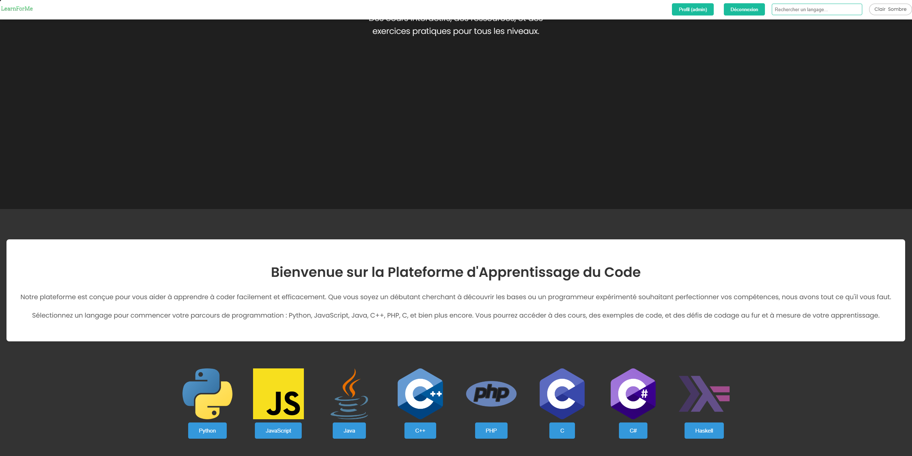

# LearnForMe: Votre Parcours de Codage Commence Ici
## Groupe

- GOLAM HOSSAIN Tamim
- Jabir Marwane
- Ousmane Djire
- Siddy DIALLO
- Yanis MEKKAOUI

## Description

LearnForMe est une plateforme d'apprentissage du code en ligne, construite avec Django. Elle offre aux étudiants une variété de ressources pour apprendre les langages de programmation, notamment :

- **Leçons vidéo :** Des tutoriels vidéo engageants pour différents concepts.
- **Ressources PDF :** Fichiers PDF téléchargeables pour un apprentissage approfondi.
- **Cours interactifs :** Des cours structurés avec des quiz et des projets.
- **Tests de codage :** Évaluez vos compétences avec des défis de codage pratiques. (Bientôt disponible)

### Fonctionnalités clés :

- **Authentification utilisateur :** Système sécurisé d'inscription et de connexion.
- **Profils utilisateur :**  Les étudiants peuvent suivre leurs progrès et gérer leur apprentissage.
- **Accès basé sur les rôles :**  Différents rôles pour les étudiants, les enseignants et les administrateurs. (En développement)
- **Interface engageante :**  Conception intuitive et conviviale pour une expérience d'apprentissage optimale.

## Technologies utilisées

- **Backend :** Python, Django    (Python 3.12.3 dans mon cas)
- **Frontend :** HTML, CSS, JavaScript
- **Base de données :** SQLite3 (Peut être facilement remplacé par PostgreSQL ou MySQL)

## Structure du projet

```
├── Learnforme/      <-- Application Django
│   ├── __init__.py
│   ├── admin.py
│   ├── asgi.py
│   ├── models.py
│   ├── settings.py
│   ├── signals.py
│   ├── urls.py
│   └── wsgi.py
├── templates/        <-- Modèles HTML
│   ├── index.html    <-- Page d'accueil principale
│   ├── login.html    <-- Page de connexion utilisateur
│   ├── createuser.html <-- Page d'inscription utilisateur
│   └── profile.html  <-- Profil utilisateur
├── static/           <-- Fichiers statiques (CSS, JavaScript, Images)
│   └── ...
└── manage.py
```

## Installation

1. **Installation de l'environnement Python 3**

   LearnForMe est construit avec Django, qui nécessite Python 3.

   Vérifiez si Python 3 est installé :
   ```
   python3 --version
   ```
   ou
   ```
   python --version
   ```

   Si Python 3 n'est pas installé, téléchargez la dernière version depuis [python.org](https://www.python.org/downloads/) et suivez les instructions d'installation pour votre système d'exploitation.

2. **Cloner le repo :**
   ```
   git clone https://github.com/Tamim94/Learnforme.git
   ```

3. **Création d'un environnement virtuel (fortement recommandé)**

   Naviguez jusqu'au dossier du projet :
   ```
   cd Learnforme
   ```

4. **Créez un environnement virtuel :**
   ```
   python3 -m venv env
   ```

5. **Activez l'environnement virtuel :**

   Sur Linux/macOS :
   ```
   source env/bin/activate
   ```

   Sur Windows :
   ```
   env\Scripts\activate
   ```

6. **Installation des dépendances**

   Assurez-vous que votre environnement virtuel est activé, puis :
   ```
   pip install -r requirements.txt
   ```

7. **Configuration de la base de données**

   Appliquez les migrations :
   ```
   python manage.py migrate
   ```

8. **Lancement du serveur de développement**
   ```
   python manage.py runserver
   ```

9. Ouvrez votre navigateur et accédez à l'URL affichée dans le terminal (généralement http://127.0.0.1:8000 ou http://localhost:).

10. **Vous devriez voir la page d'accueil de LearnForMe !**

    À partir de là, vous pouvez vous inscrire, vous connecter et commencer à explorer les ressources d'apprentissage du code. Vous pourrez créer un compte étudiant, enseignant ou administrateur.

## Remarques

Si vous n'avez pas pu créer un compte, vous pouvez utiliser les identifiants suivants :
- Nom d'utilisateur : `root`
- Mot de passe : `root`

Vous pouvez également créer un compte superuser en tapant la commande suivante :
```
python manage.py createsuperuser
```

**Si vous rencontrez des problèmes lors de l'installation, vérifiez que vous avez suivi correctement toutes les étapes et que vous disposez des versions correctes de Python, Django et des autres dépendances. N'hésitez pas à nous poser des questions si vous rencontrez des difficultés !**

## Contributeurs

- GOLAM Tamim
- Jabir Marwane
- Ousmane Djire
- Siddy DIALLO
- Yanis MEKKAOUI


Page d'accueil : 
